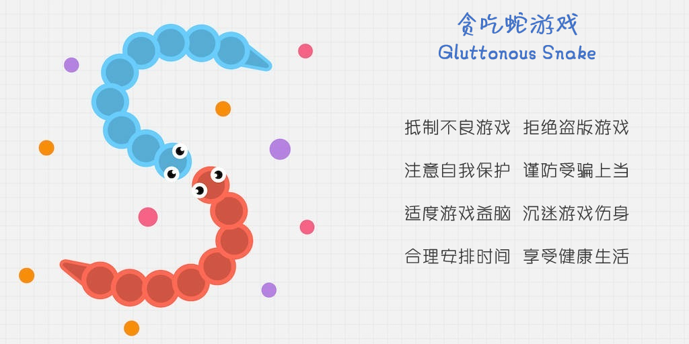
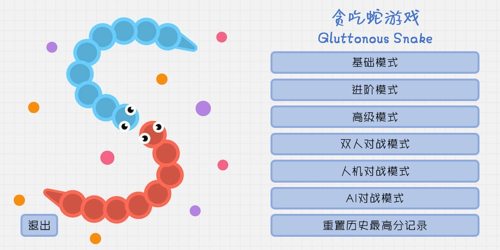
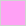

# Gluttonous Snake

## 项目名称

Gluttonous_Snake

## 项目实现功能

贪吃蛇游戏

<p align="center">
  
</p>

1. 基础模式

   玩家通过上下左右方向键或WSAD键控制蛇的移动方向，使蛇吃掉随机生成的食物。当蛇头与边界或蛇身相撞，或蛇的长度为1，或剩余空间不足以生成新的蛇和食物时，游戏结束。

1. 进阶模式

   玩家通过上下左右方向键或WSAD键控制蛇的移动方向，使蛇吃掉随机生成的食物。当蛇头与边界或蛇身相撞，或蛇的长度为1时，得分－100，蛇将变成边界并生成一条新的蛇，当剩余空间不足以生成新的蛇和食物时，游戏结束。

1. 高级模式

   玩家通过上下左右方向键或WSAD键控制蛇的移动方向，使蛇吃掉随机生成的食物。当蛇头与边界或蛇身相撞，或蛇的长度为1时，得分－100，蛇将变成食物并生成一条新的蛇，当蛇的死亡次数达到5次或剩余空间不足以生成新的蛇和食物时，游戏结束。

1. 双人对战模式

   玩家通过上下左右方向键控制粉蛇的移动方向，通过WSAD键控制蓝蛇的移动方向，使蛇吃掉随机生成的食物。当任意一条蛇的蛇头与边界或蛇身相撞，或蛇的长度为1，或剩余空间不足以生成新的蛇和食物时，游戏结束。

1. 人机对战模式

   玩家通过上下左右方向键或WSAD键控制蓝蛇的移动方向，使蛇吃掉随机生成的食物。当任意一条蛇的蛇头与边界或蛇身相撞，或蛇的长度为1，或剩余空间不足以生成新的蛇和食物时，游戏结束。

1. AI对战模式

   两条AI蛇通过AI算法移动方向，使蛇吃掉随机生成的食物。当任意一条蛇的蛇头与边界或蛇身相撞，或蛇的长度为1，或剩余空间不足以生成新的蛇和食物时，游戏结束。

1. 重置历史最高分记录

   重置所有模式历史最高分为0。

<p align="center">
  
</p>

## 项目文件组成

### 头文件

* `gluttonous_snake.h`
`Control` 类、 `Snake` 类、历史最高分记录函数、游戏函数、图形化界面函数、主函数、菜单函数的头文件

### 源文件

* `gluttonous_snake_control.cpp`
`Control` 类的实现

* `gluttonous_snake_file.cpp`
历史最高分记录函数的实现

* `gluttonous_snake_game.cpp`
游戏函数的实现

* `gluttonous_snake_graphics.cpp`
图形化界面函数的实现

* `gluttonous_snake_main.cpp`
主体函数的实现

* `gluttonous_snake_menu.cpp`
菜单函数的实现

* `gluttonous_snake_snake.cpp`
`Snake` 类的实现

### 资源文件

* `data文件夹`
存放项目所需的资源文件

  * `highest_score.dat`
  历史最高分记录文件

  * `start_page.png`
  初始界面

  * `menu_page.png`
  菜单界面

  * `basic_mode_page.png`
  基础模式玩法界面

  * `advanced_mode_page.png`
  进阶模式玩法界面

  * `expert_mode_page.png`
  高级模式玩法界面

  * `human_vs_human_mode_page.png`
  双人对战模式玩法界面

  * `human_vs_AI_mode_page.png`
  人机对战模式玩法界面

  * `AI_vs_AI_mode_page.png`
  AI对战模式玩法界面

  * `reset_highest_score_page.png`
  历史最高分记录重置成功界面

  * `default_end_page.png`
  默认结束界面

  * `human_snake_A_end_page.png`
  蓝蛇（人类蛇）结束界面

  * `AI_snake_A_end_page.png`
  蓝蛇（AI蛇）结束界面

  * `human_snake_B_end_page.png`
  粉蛇（人类蛇）结束界面

  * `AI_snake_B_end_page.png`
  粉蛇（AI蛇）结束界面

  * `snake_A_head_up.png`
  蓝蛇向上蛇头贴图

  * `snake_A_head_down.png`
  蓝蛇向下蛇头贴图

  * `snake_A_head_left.png`
  蓝蛇向左蛇头贴图

  * `snake_A_head_right.png`
  蓝蛇向右蛇头贴图

  * `snake_B_head_up.png`
  粉蛇向上蛇头贴图

  * `snake_B_head_down.png`
  粉蛇向下蛇头贴图

  * `snake_B_head_left.png`
  粉蛇向左蛇头贴图

  * `snake_B_head_right.png`
  粉蛇向右蛇头贴图

* `assets文件夹`
存放 `README.md` 文件所需的相关图片资源

## 项目技术细节

### `Snake` 类的实现

#### 概述

`Snake` 类是一个表示贪吃蛇游戏中蛇的实体的C++类。该类包含了蛇在游戏中的各种属性和行为，用于管理蛇的状态、移动和与游戏地图的交互。

#### 类定义

```cpp
const enum SnakeCategory { SnakeA, SnakeB, InvalidSnakeCategory };

class Snake {
private:
    SnakeCategory snakeCategory;
    GridCondition** map;
    struct SnakeSegment {
        COORD coordinate;
        Direction direction;
        SnakeSegment* nextSegment;
    };
    SnakeSegment* head;
    SnakeSegment* tail;
    int* pGoodFood;
    int* pGreatFood;
    int* pBadFood;
    int* pBoomFood;
    int* pObstacle;
    int score = 0;
    int length = 1;
    int death = 0;
    void deleteSnake(void);
    void addSegment(Direction direction);
    void deleteSegment(void);
    bool findEmptySpace(COORD& coord, Direction& direction, bool is_multiplayer);
    Point findClosestCoordinate(void);
    Point findNextStep(int map[][gridCol], int startRow, int startCol, int targetRow, int targetCol);
public:
    friend class Control;
    ~Snake();
    bool generateSnake(bool is_multiplayer = false);
    void refreshSnake(void);
    void changeGridCondition(GridCondition gridCondition);
    void correct(int len);
    bool changeDirection(Direction direction);
    int getLength(void);
    int getDeath(void);
    Direction getSnakeDirection(void);
    Direction BFS(void);
};
```

#### 私有数据成员

```cpp
SnakeCategory snakeCategory; //蛇的类别标识
```

```cpp
GridCondition** map; //游戏地图的首地址
```

```cpp
struct SnakeSegment { //链表形式表示蛇的身体
    COORD coordinate; //当前身体段坐标
    Direction direction; //当前身体段方向
    SnakeSegment* nextSegment; //下一身体段地址
};
```

```cpp
SnakeSegment* head; //指向蛇头
```

```cpp
SnakeSegment* tail; //指向蛇尾
```

```cpp
int* pGoodFood; //游戏地图中“食物”数量的指针
```

```cpp
int* pGreatFood; //游戏地图中“美食”数量的指针
```

```cpp
int* pBadFood; //游戏地图中“恶果”数量的指针
```

```cpp
int* pBoomFood; //游戏地图中“炸弹”数量的指针
```

```cpp
int* pObstacle; //游戏地图中“障碍”数量的指针
```

```cpp
int score = 0; //蛇的得分
```

```cpp
int length = 1; //蛇的长度
```

```cpp
int death = 0; //蛇的死亡次数
```

#### 析构函数

```cpp
~Snake();
```
释放内存。

#### 私有成员函数

```cpp
void deleteSnake(void);
```
删除蛇的所有身体段。

```cpp
void addSegment(Direction direction);
```
在蛇的尾部添加一个身体段。

```cpp
void deleteSegment(void);
```
在蛇的尾部删除一个身体段。

```cpp
bool findEmptySpace(COORD& coord, Direction& direction, bool is_multiplayer);
```
查找连续的空白空间，用于生成蛇的初始位置。

```cpp
Point findClosestCoordinate(void);
```
查找最近的目标坐标，用于BFS算法。

```cpp
Point findNextStep(int map[][gridCol], int startRow, int startCol, int targetRow, int targetCol);
```
使用BFS算法获取蛇的下一步移动。

#### 公有成员函数

```cpp
bool generateSnake(bool is_multiplayer = false);
```
生成蛇的初始状态。

```cpp
void refreshSnake(void);
```
刷新蛇的状态，在蛇死亡时调用。

```cpp
void changeGridCondition(GridCondition gridCondition);
```
改变蛇头和身体的状态。

```cpp
void correct(int len);
```
校正蛇的长度和分数。

```cpp
bool changeDirection(Direction direction);
```
改变蛇的移动方向。

```cpp
int getLength(void);
```
获取蛇的长度。

```cpp
int getDeath(void);
```
获取蛇的死亡次数。

```cpp
Direction getSnakeDirection(void);
```
获取蛇头的移动方向。

```cpp
Direction BFS(void);
```
使用BFS算法获取蛇的下一步移动方向。

#### 友元类

```cpp
friend class Control;
```
声明 `Control` 类为 `Snake` 类的友元类。

### `Control` 类的实现

#### 概述

`Control` 类是一个用于管理贪吃蛇游戏的控制类，它包含了游戏的各种状态和逻辑控制。该类负责管理游戏模式、地图状态、游戏元素生成和信息显示等功能，与 `Snake` 类一起协作，实现了整个贪吃蛇游戏的核心逻辑。

#### 类定义

```cpp
const enum Mode { BasicMode, AdvancedMode, ExpertMode, HumanVsHumanMode, HumanVsAIMode, AIVsAIMode, ResetHighestScore, Quit };

class Control {
private:
    Mode mode;
    DWORD startTickCount;
    GridCondition** map;
    int* pGoodFood;
    int* pGreatFood;
    int* pBadFood;
    int* pBoomFood;
    int* pObstacle;
    void allocateAndInitialize(int*& p);
    void setObstacles(void);
    int count(GridCondition gridCondition);
public:
    Snake Snake_A;
    Snake Snake_B;
    Control(Mode _mode);
    ~Control();
    void generateGrid(GridCondition gridCondition);
    void print_information(void);
    void refreshMap(void);
    int getHighestScore(void);
};
```

#### 私有数据成员

```cpp
Mode mode; //游戏模式
```

```cpp
DWORD startTickCount; //游戏开始时的系统时间计数。
```

```cpp
GridCondition** map; //游戏地图的首地址
```

```cpp
int* pGoodFood; //游戏地图中“食物”数量的指针
```

```cpp
int* pGreatFood; //游戏地图中“美食”数量的指针
```

```cpp
int* pBadFood; //游戏地图中“恶果”数量的指针
```

```cpp
int* pBoomFood; //游戏地图中“炸弹”数量的指针
```

```cpp
int* pObstacle; //游戏地图中“障碍”数量的指针
```

#### 公有数据成员

```cpp
Snake Snake_A; //Snake对象，代表玩家或AI控制的蛇
```

```cpp
Snake Snake_B; //Snake对象，代表玩家或AI控制的蛇
```

#### 构造函数

```cpp
Control(Mode _mode);
```
构造函数，初始化 `Control` 对象并分配游戏地图内存。

#### 析构函数

```cpp
~Control();
```
释放内存。

#### 私有成员函数

```cpp
void allocateAndInitialize(int*& p);
```
为 `int` 型数据指针分配内存并初始化为0。

```cpp
void setObstacles(void);
```
在游戏地图上设置固定的边界。

```cpp
int count(GridCondition gridCondition);
```
计算特定类型的地图元素在游戏地图中的数量。

#### 公有成员函数

```cpp
void generateGrid(GridCondition gridCondition);
```
生成特定类型的地图元素。

```cpp
void print_information(void);
```
打印游戏信息，包括游戏模式、游戏得分、蛇的长度、死亡次数、游戏时间。

```cpp
void refreshMap(void);
```
刷新游戏地图，更新游戏地图中特定类型的地图元素的数量。

```cpp
int getHighestScore(void);
```
获取当前游戏最高分数。

### 游戏地图元素的实现

游戏地图元素通过在 `gluttonous_snake.h` 中定义枚举类型常变量，并保存在 `GridCondition` 类型的二维数组 `map[gridRow][gridCol]` 中实现，通过 `Control` 类实现游戏地图元素和 `Snake` 类的交互。

```cpp
const enum GridCondition { GridBlank, GridWall, SnakeHead, SnakeBody, GoodFood, GreatFood, BadFood, BoomFood, GridObstacle };
```

游戏地图元素的RGB颜色在 `gluttonous_snake.h` 中定义。

```cpp
#define GRID_BLANK_COLOR RGB(255, 255, 255)
#define GRID_WALL_COLOR RGB(130, 130, 130)
#define GRID_OBSTACLE_COLOR RGB(170, 170, 170)
#define SNAKE_A_COLOR RGB(102, 202, 251)
#define SNAKE_B_COLOR RGB(255, 161, 245)
#define GOOD_FOOD_COLOR RGB(246, 250, 112)
#define GREAT_FOOD_COLOR RGB(0, 223, 162)
#define BAD_FOOD_COLOR RGB(121, 63, 223)
#define BOOM_FOOD_COLOR RGB(255, 0, 96)
```

游戏地图元素的属性（最大数量和得分效果）在 `gluttonous_snake.h` 中定义。

```cpp
const int maxGoodFood = 12;
const int maxGreatFood = 4;
const int maxBadFood = 6;
const int maxBoomFood = 2;
const int maxObstacle = 4;
const int goodScore = 10;
const int greatScore = 50;
const int badScore = -20;
const int boomScore = -40;
const int obstacleScore = -30;
```

游戏地图元素数量的指针作为 `Control` 类和 `Snake` 类的成员，在初始化 `Control` 对象时分配内存并将它们指向相同的内存区域以实现数据共享。

```cpp
class Snake {
private:
    int* pGoodFood;
    int* pGreatFood;
    int* pBadFood;
    int* pBoomFood;
    int* pObstacle;
    ...
public:
    ...
};

class Control {
private:
    int* pGoodFood;
    int* pGreatFood;
    int* pBadFood;
    int* pBoomFood;
    int* pObstacle;
    ...
public:
    Snake Snake_A;
    Control(Mode _mode) {
        allocateAndInitialize(pGoodFood);
        allocateAndInitialize(pGreatFood);
        allocateAndInitialize(pBadFood);
        allocateAndInitialize(pBoomFood);
        allocateAndInitialize(pObstacle);
        Snake_A.pGoodFood = pGoodFood;
        Snake_A.pGreatFood = pGreatFood;
        Snake_A.pBadFood = pBadFood;
        Snake_A.pBoomFood = pBoomFood;
        Snake_A.pObstacle = pObstacle;
        ...
    }
    ~Control() {
        delete pGoodFood;
        delete pGreatFood;
        delete pBadFood;
        delete pBoomFood;
        delete pObstacle;
        ...
    }
    ...
};
```

游戏地图元素效果在 `Snake` 类的公有成员函数 `changeDirection` 中实现。

```cpp
switch (nextCondition) {
    case GridBlank:
        break;
    case GridWall:
    case SnakeHead:
    case SnakeBody:
        return false;
    case GoodFood:
        addSegment(tailDirection);
        score += goodScore;
        (*pGoodFood)--;
        break;
    case BadFood:
        score += badScore;
        (*pBadFood)--;
        break;
    case GridObstacle:
        deleteSegment();
        deleteSegment();
        score += obstacleScore;
        (*pObstacle)--;
        break;
    case GreatFood:
        score += greatScore;
        (*pGreatFood)--;
        break;
    case BoomFood: {
        int len = length / 2;
        for (int i = 0; i < len; i++)
            deleteSegment();
        score += boomScore;
        (*pBoomFood)--;
        break;
    }
    default:
        exit(-1);
}
```

游戏地图元素的属性信息：

* <p align="left">
     空白（效果：无）
  </p>

* <p align="left">
     边界（效果：特定模式下游戏得分-100 死亡次数+1）
  </p>

* <p align="left">
     蓝蛇蛇头（效果：特定模式下游戏得分-100 死亡次数+1）
  </p>

* <p align="left">
     蓝蛇蛇身（效果：特定模式下游戏得分-100 死亡次数+1）
  </p>

* <p align="left">
     粉蛇蛇头（效果：特定模式下游戏得分-100 死亡次数+1）
  </p>

* <p align="left">
     粉蛇蛇身（效果：特定模式下游戏得分-100 死亡次数+1）
  </p>

* <p align="left">
     食物（效果：游戏得分+10 蛇的长度+1）
  </p>

* <p align="left">
     美食（效果：游戏得分+50 蛇的长度不变）
  </p>

* <p align="left">
     恶果（效果：游戏得分-20 蛇的长度不变）
  </p>

* <p align="left">
     炸弹（效果：游戏得分-40 蛇的长度减半）
  </p>

* <p align="left">
     障碍（效果：游戏得分-30 蛇的长度-2）
  </p>

### 鼠标事件的读取

```cpp
while (true) {
    MOUSEMSG m{ 0 };
    if (MouseHit())
        m = GetMouseMsg();
    switch (m.uMsg) {
        case WM_MOUSEMOVE:
            //鼠标移动消息
            break;
        case WM_MOUSEWHEEL:
            //鼠标滚轮拨动消息
            break;
        case WM_LBUTTONDOWN:
            //左键按下消息
            break;
        case WM_LBUTTONDBLCLK:
            //左键双击消息
            break;
        case WM_MBUTTONDOWN:
            //中键按下消息
            break;
        case WM_MBUTTONDBLCLK:
            //中键双击消息
            break;
        case WM_RBUTTONDOWN:
            //右键按下消息
            break;
        case WM_RBUTTONDBLCLK:
            //右键双击消息
            break;
        default:
            break;
    }
}
```

### 键盘事件的读取

```cpp
static void getDirection(Direction& direction_A, Direction& direction_B)
{
    if (_kbhit()) {
        int key = _getch();
        if (key == 0 || key == 0xE0) {
            key = _getch();
            if (key == 'H' && direction_B != Down)
                direction_B = Up;
            else if (key == 'P' && direction_B != Up)
                direction_B = Down;
            else if (key == 'K' && direction_B != Right)
                direction_B = Left;
            else if (key == 'M' && direction_B != Left)
                direction_B = Right;
        }
        else {
            if ((key == 'W' || key == 'w') && direction_A != Down)
                direction_A = Up;
            else if ((key == 'S' || key == 's') && direction_A != Up)
                direction_A = Down;
            else if ((key == 'A' || key == 'a') && direction_A != Right)
                direction_A = Left;
            else if ((key == 'D' || key == 'd') && direction_A != Left)
                direction_A = Right;
        }
    }
}
```

### 使用广度优先搜索算法进行寻路的实现

#### 获取目标位置坐标

```cpp
Point Snake::findClosestCoordinate(void)
{
    int headRow = head->coordinate.Y, headCol = head->coordinate.X;
    for (int distance = 1; distance <= max(gridRow, gridCol) - 3; distance++)
        for (int r = max((headRow - distance), 1); r <= min((headRow + distance), (gridRow - 2)); r++)
            for (int c = max((headCol - distance), 1); c <= min((headCol + distance), (gridCol - 2)); c++)
                if ((r == headRow - distance || r == headRow + distance || c == headCol - distance || c == headCol + distance) && (map[r][c] == GoodFood || map[r][c] == GreatFood))
                    return { r, c };
    return { INVALID_ROW, INVALID_COLUMN };
}
```

#### 使用BFS算法获取蛇的下一步移动

```cpp
Point Snake::findNextStep(int map[][gridCol], int startRow, int startCol, int targetRow, int targetCol)
{
    /* Define movement directions: up, down, left, right */
    int dx[] = { -1, 1, 0, 0 };
    int dy[] = { 0, 0, -1, 1 };

    /* Create a boolean matrix to track visited cells */
    bool visited[gridRow][gridCol] = { false };

    /* Create a matrix to store the parent of each cell in the path */
    Point parent[gridRow][gridCol];

    /* Mark the starting cell as visited */
    visited[startRow][startCol] = true;
    parent[startRow][startCol] = { INVALID_ROW, INVALID_COLUMN };

    /* Initialize a queue for BFS traversal */
    Point queue[gridRow * gridCol];
    int front = 0, rear = 1;
    queue[0] = { startRow, startCol };

    /* Perform BFS to find the path to the target */
    while (front < rear) {
        /* Get the current cell from the queue */
        Point current = queue[front++];

        /* Check if we have reached the target cell */
        if (current.row == targetRow && current.col == targetCol) {
            /* Reconstruct the path from the target to the start */
            Point path[gridRow * gridCol], temp = { targetRow, targetCol };
            int pathLength = 0;

            /* Traverse the path in reverse order and store it */
            while (temp.row != startRow || temp.col != startCol) {
                path[pathLength++] = temp;
                temp = parent[temp.row][temp.col];
            }

            /* Return the next step in the path */
            return { path[pathLength - 1].row, path[pathLength - 1].col };
        }

        /* Explore adjacent cells in all four directions */
        for (int dir = 0; dir < 4; dir++) {
            /* Save new row and new column */
            int newRow = current.row + dx[dir], newCol = current.col + dy[dir];

            /* Check if the new cell is within bounds, is open, and hasn't been visited */
            if (newRow >= 0 && newRow < gridRow && newCol >= 0 && newCol < gridCol && map[newRow][newCol] == 0 && !visited[newRow][newCol]) {
                /* Mark the new cell as visited and set its parent */
                visited[newRow][newCol] = true;
                parent[newRow][newCol] = current;

                /* Add the new cell to the queue for further exploration */
                queue[rear++] = { newRow, newCol };
            }
        }
    }

    /* If no path is found, return an invalid point */
    return { INVALID_ROW, INVALID_COLUMN };
}
```

#### 使用BFS算法获取蛇的下一步移动方向

```cpp
Direction Snake::BFS(void)
{
    /* Find closest target coordinate */
    Direction currentDirection = head->direction;
    Point target = findClosestCoordinate();
    if (target.row == INVALID_ROW && target.col == INVALID_COLUMN)
        return currentDirection;

    /* Convert an array of GridCondition types into an array of integers */
    int mat[gridRow][gridCol];
    for (int i = 0; i < gridRow; i++)
        for (int j = 0; j < gridCol; j++)
            mat[i][j] = (map[i][j] == GridWall || map[i][j] == SnakeHead || map[i][j] == SnakeBody);
    mat[target.row][target.col] = 0;
    mat[head->coordinate.Y][head->coordinate.X] = 0;

    /* Use BFS to find next step */
    Point next = findNextStep(mat, head->coordinate.Y, head->coordinate.X, target.row, target.col);

    /* If the path is not found return current direction */
    if (next.row == INVALID_ROW && next.col == INVALID_COLUMN)
        return currentDirection;

    /* Return the direction of the next move */
    if (next.row < head->coordinate.Y && currentDirection != Down)
        return Up;
    else if (next.row > head->coordinate.Y && currentDirection != Up)
        return Down;
    else if (next.col < head->coordinate.X && currentDirection != Right)
        return Left;
    else if (next.col > head->coordinate.X && currentDirection != Left)
        return Right;
    else
        return currentDirection;
}
```

### 游戏主体架构

#### 基础模式、进阶模式、高级模式的游戏主体架构

```cpp
/* Process initialization work */
initialize_graphics(mode);
Control control(mode);
EndPageCategory endPageCategory = PageDefault;
bool flag = true;
int lastLength = 1;

/* Play gluttonous snake game */
while (flag) {
    /* Check if the snake has been successfully generated */
    bool is_generate = control.Snake_A.generateSnake();
    if (!is_generate) {
        if (mode == AdvancedMode)
            control.Snake_A.correct(lastLength);
        break;
    }
    Sleep(timeThreshold);

    /* Move the snake */
    while (true) {
        /* Check if the screen has no space to generate food */
        if (control.Snake_A.getLength() == (gridRow - 2) * (gridCol - 2)) {
            flag = false;
            break;
        }

        /* Generate specific grid condition */
        for (int i = GoodFood; i <= GridObstacle; i++)
            control.generateGrid((GridCondition)i);

        /* Print information */
        control.print_information();

        /* Get snake head direction */
        Direction direction = control.Snake_A.getSnakeDirection();
        getDirection(direction, direction);

        /* Change snake direction */
        if (!control.Snake_A.changeDirection(direction)) {
            control.print_information();
            break;
        }
        Sleep(timeThreshold);
    }

    /* Handle tasks after the snake's death */
    switch (mode) {
        case BasicMode:
            flag = false;
            break;
        case AdvancedMode:
            control.Snake_A.changeGridCondition(GridWall);
            control.refreshMap();
            lastLength = control.Snake_A.getLength();
            control.Snake_A.refreshSnake();
            flag = true;
            break;
        case ExpertMode:
            control.Snake_A.changeGridCondition(GoodFood);
            control.refreshMap();
            lastLength = control.Snake_A.getLength();
            control.Snake_A.refreshSnake();
            if (control.Snake_A.getDeath() >= deathCountMaximum) {
                control.Snake_A.correct(lastLength);
                flag = false;
            }
            else
                flag = true;
            break;
        default:
            exit(-1);
    }
}

/* Print information */
control.print_information();

/* Update highest score */
if (control.getHighestScore() > readHighestScore(mode))
    updateHighestScore(mode, control.getHighestScore());

/* Display end page */
endPage(endPageCategory);
```

#### 双人对战模式、人机对战模式、AI对战模式的游戏主体架构

```cpp
/* Process initialization work */
initialize_graphics(mode);
Control control(mode);
EndPageCategory endPageCategory = PageDefault;
bool flag = true;

/* Play gluttonous snake game */
while (flag) {
    /* Check if the snakes have been successfully generated */
    bool is_generate_A = control.Snake_A.generateSnake(true);
    bool is_generate_B = control.Snake_B.generateSnake(true);
    if (!is_generate_A || !is_generate_B)
        break;
    Sleep(mode == AIVsAIMode ? timeAIThreshold : timeThreshold);

    /* Move the snakes */
    while (true) {
        /* Check if the screen has no space to generate food */
        if (control.Snake_A.getLength() + control.Snake_B.getLength() == (gridRow - 2) * (gridCol - 2)) {
            flag = false;
            break;
        }

        /* Generate specific grid condition */
        for (int i = GoodFood; i <= GridObstacle; i++)
            control.generateGrid((GridCondition)i);

        /* Print information */
        control.print_information();

        /* Get snake head direction */
        Direction direction_A = control.Snake_A.getSnakeDirection();
        Direction direction_B = control.Snake_B.getSnakeDirection();
        switch (mode) {
            case HumanVsHumanMode:
                getDirection(direction_A, direction_B);
                break;
            case HumanVsAIMode:
                getDirection(direction_A, direction_A);
                direction_B = control.Snake_B.BFS();
                break;
            case AIVsAIMode:
                direction_A = control.Snake_A.BFS();
                direction_B = control.Snake_B.BFS();
                break;
            default:
                exit(-1);
        }

        /* Change snake direction */
        if (!control.Snake_A.changeDirection(direction_A)) {
            control.print_information();
            flag = false;
            switch (mode) {
                case HumanVsHumanMode:
                    endPageCategory = PageHumanSnakeB;
                    break;
                case HumanVsAIMode:
                    endPageCategory = PageAISnakeB;
                    break;
                case AIVsAIMode:
                    endPageCategory = PageAISnakeB;
                    break;
                default:
                    exit(-1);
            }
            break;
        }
        if (!control.Snake_B.changeDirection(direction_B)) {
            control.print_information();
            flag = false;
            switch (mode) {
                case HumanVsHumanMode:
                    endPageCategory = PageHumanSnakeA;
                    break;
                case HumanVsAIMode:
                    endPageCategory = PageHumanSnakeA;
                    break;
                case AIVsAIMode:
                    endPageCategory = PageAISnakeA;
                    break;
                default:
                    exit(-1);
            }
            break;
        }
        Sleep(mode == AIVsAIMode ? timeAIThreshold : timeThreshold);
    }
}

/* Print information */
control.print_information();

/* Update highest score */
if (control.getHighestScore() > readHighestScore(mode))
    updateHighestScore(mode, control.getHighestScore());

/* Display end page */
endPage(endPageCategory);
```

### 历史最高分记录功能的实现
       
#### 更新历史最高分记录文件

```cpp
void updateHighestScore(Mode mode, int score)
{
    int highestScore[MODE_NUMBER];
    readArrayFromFile("data/highest_score.dat", highestScore, MODE_NUMBER);
    highestScore[mode] = score;
    saveArrayToFile("data/highest_score.dat", highestScore, MODE_NUMBER);
}
```

#### 读取历史最高分记录文件

```cpp
int readHighestScore(Mode mode)
{
    int highestScore[MODE_NUMBER];
    readArrayFromFile("data/highest_score.dat", highestScore, MODE_NUMBER);
    return highestScore[mode];
}

```

#### 重置历史最高分记录文件

```cpp
void resetHighestScore(void)
{
    int highestScore[MODE_NUMBER] = { 0 };
    saveArrayToFile("data/highest_score.dat", highestScore, MODE_NUMBER);
}
```

## 集成开发环境

* Microsoft Visual Studio

## 编译运行环境

* 本项目仅适用于x86架构

## 库依赖

* EasyX

## 文档更新日期

2023年9月24日