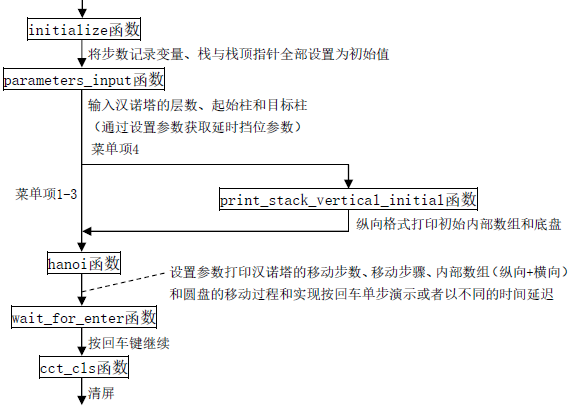
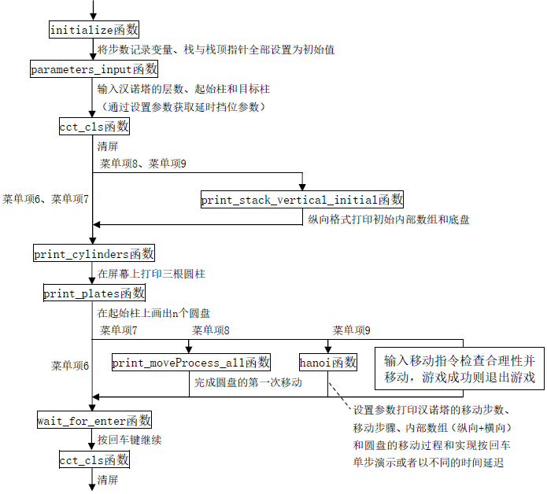

# Hanoi Tower Demonstration

## 项目名称

Hanoi_Tower_Demonstration

## 项目实现功能

汉诺塔综合演示解决方案

1. 基本解

1. 基本解(步数记录)

1. 内部数组显示(横向)

1. 内部数组显示(纵向+横向)

1. 图形解(预备:画三个圆柱)

1. 图形解(预备:在起始柱上画n个盘子)

1. 图形解(预备:第一次移动)

1. 图形解(自动移动版本)

1. 图形解(游戏版)

## 项目文件组成

### 头文件

* `cmd_console_tools.h`
伪图形界面函数工具集的头文件

* `hanoi.h`
主体函数、菜单函数、汉诺塔综合演示解决方案函数的头文件

### 源文件

* `cmd_console_tools.cpp`
伪图形界面函数工具集的实现

* `hanoi_main.cpp`
主体函数的实现

* `hanoi_menu.cpp`
菜单函数的实现

* `hanoi_solution.cpp`
汉诺塔综合演示解决方案函数的实现

### 资源文件

* `assets文件夹`
存放 `README.md` 文件所需的相关图片资源

## 项目技术细节

### 各菜单项功能实现细节

#### 基本解

输入汉诺塔的层数、起始柱和目标柱，在屏幕上打印汉诺塔的移动步骤。

#### 基本解(步数记录)

输入汉诺塔的层数、起始柱和目标柱，在屏幕上打印汉诺塔的移动步数和移动步骤。

#### 内部数组显示(横向)

输入汉诺塔的层数、起始柱和目标柱，在屏幕上打印汉诺塔的移动步数、移动步骤和内部数组（横向）。

#### 内部数组显示(纵向+横向)

输入汉诺塔的层数、起始柱、目标柱和延时挡位，显示输入的起始柱、目标柱、层数和延时挡位的提示，按回车单步演示或者以不同的时间延迟，在屏幕上打印汉诺塔的移动步数、移动步骤和内部数组（纵向+横向）。

<p align="center">
  
</p>

#### 图形解(预备:画三个圆柱)

调用 `print_cylinders` 函数在屏幕上打印三根圆柱，并通过延时体现出动画效果。

#### 图形解(预备:在起始柱上画n个盘子)

输入汉诺塔的层数、起始柱和目标柱，显示输入的起始柱、目标柱和层数的提示，在屏幕上打印三根圆柱，在起始柱上画出n个圆盘，并通过延时体现出动画效果。

#### 图形解(预备:第一次移动)

输入汉诺塔的层数、起始柱和目标柱，显示输入的起始柱、目标柱和层数的提示，在屏幕上打印三根圆柱，在起始柱上画出n个圆盘，完成圆盘的第一次移动（先上移、再平移、最后下移），并通过延时体现出动画效果。

#### 图形解(自动移动版本)

输入汉诺塔的层数、起始柱、目标柱和延时挡位，显示输入的起始柱、目标柱、层数和延时挡位的提示，在屏幕上打印三根圆柱，在起始柱上画出n个圆盘，按回车单步演示或者以不同的时间延迟，在屏幕上打印汉诺塔的移动步数、移动步骤、内部数组（纵向+横向）和圆盘的移动过程（先上移、再平移、最后下移），完整实现汉诺塔演示过程。

#### 图形解(游戏版)

输入汉诺塔的层数、起始柱和目标柱，显示输入的起始柱、目标柱和层数的提示，在屏幕上打印三根圆柱，在起始柱上画出n个圆盘，在屏幕上打印初始时汉诺塔的内部数组（纵向+横向），提示输入移动指令，输入并检查合理性，若输入不合理，则重输，若输入合理但不符合移动规则（如大盘压小盘、源柱为空等），则提示出错信息并重输，若输入合理且符合移动规则，记录移动步数并打印汉诺塔的移动步数、移动步骤、内部数组（纵向+横向）和圆盘的移动过程（先上移、再平移、最后下移），并提示输入下一次移动指令，若输入Q/q，则提示中止信息并退出游戏，若游戏成功（所有盘子按序移动到结束柱），则提示结束信息并退出游戏。

<p align="center">
  
</p>

### 汉诺塔递归函数

```cpp
void hanoi(int n, char src, char tmp, char dst)
{
    if (n > 1)
        hanoi(n - 1, src, dst, tmp);
    cout << n << "#: " << src << "->" << dst << endl;
    if (n > 1)
        hanoi(n - 1, tmp, src, dst);
}
```

## 集成开发环境

* Microsoft Visual Studio

## 编译运行环境

* 本项目仅适用于x86架构

* Windows控制台主机的旧版控制台运行（取消选项“快速编辑模式”和“插入模式”）

## 文档更新日期

2023年9月28日