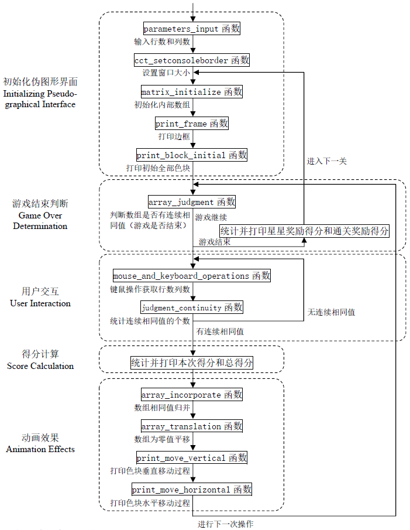

# Popstar

## 项目名称

Popstar

## 项目实现功能

消灭星星游戏

1. 命令行找出可消除项并标识

1. 命令行完成一次消除（分步骤显示）

1. 命令行完成一关（分步骤显示）

1. 伪图形界面下用鼠标选择一个色块（无分隔线）

1. 伪图形界面下用鼠标选择一个色块（有分隔线）

1. 伪图形界面完成一次消除（分步骤）

1. 伪图形界面完整版

## 项目文件组成

### 头文件

* `cmd_console_tools.h`
伪图形界面函数工具集的头文件

* `popstar.h`
菜单函数、内部数组方式函数、伪图形界面方式函数、工具函数的头文件

### 源文件

* `cmd_console_tools.cpp`
伪图形界面函数工具集的实现

* `popstar_base.cpp`
内部数组方式函数的实现

* `popstar_console.cpp`
伪图形界面方式函数的实现

* `popstar_main.cpp`
菜单函数的实现

* `popstar_tools.cpp`
工具函数的实现

### 资源文件

* `assets文件夹`
存放 `README.md` 文件所需的相关图片资源

## 项目技术细节

### 各菜单项功能实现细节

#### 菜单项A-C：内部数组方式实现“消灭星星”游戏

输入行数与列数，初始化内部数组，在内部数组中产生随机值，随机值为1-5（等概率），代表五种颜色的星星，命令行找出可消除项并标识，找出所有可消除项后，确定是否需要合并，如果某次消除后无法找到任何可消除位置，则提示游戏结束，每次合成操作包括查找相邻项、消除相邻项、计算得分、下落消除零、平移右侧列，要在程序实现时逐步打印出来。完成每关后给出剩余的星星数量。

#### 菜单项D-G：伪图形界面方式实现“消灭星星”游戏

输入行数与列数，初始化内部数组，在内部数组中产生随机值，随机值为1-5（等概率），代表五种颜色的星星，在伪图形化界面下进行合成，箭头键/鼠标移动选择色块，回车键/鼠标单击选定消除位置，并将所有可消除的色块标注出来，选定后按回车/再次单击鼠标则进行一次消除，如果需要取消本次选定并重新选择，可以再次用箭头键移动/鼠标移出当前色块范围，再次消除操作包括消除相邻项、下落消除零、右侧列平移、计算得分的操作，要在程序实现时逐步展现出来，其中下落必须有动画效果。

### 游戏主体架构

#### 初始化伪图形界面

输入行数与列数，设置窗口大小，初始化内部数组，在内部数组中产生随机值，随机值为1-5（等概率），代表五种颜色的星星，打印边框和初始全部色块。

#### 游戏结束判断

如果整个数组无相邻位置值相等，无法找到可消除位置，则游戏结束。若游戏结束，则计算得分，在边框上下的两个状态栏打印提示信息、星星奖励得分、通关奖励得分和总得分，并等待回车进入下一关。

#### 用户交互

通过键盘或鼠标操作来与游戏进行交互。箭头键/鼠标移动选择色块，鼠标移动或键盘方向键操作时，经过的色块用反显方式（框线用不同颜色显示）以区分，同时下方显示经过的行列值，如果鼠标移出范围，则显示非法位置，同时当前色块的反显取消。回车键/鼠标单击选定消除位置，并将所有可消除的色块标注出来，选定后按回车/再次单击鼠标则进行一次消除，如果需要取消本次选定并重新选择，可以再次用箭头键移动/鼠标移出当前色块范围。

#### 得分计算

每次新增得分为消除星星个数²×5，每关结束后根据剩下的星星数给予星星奖励得分，每关设置通关目标，若达到通关目标则奖励通关奖励得分。在边框上下的两个状态栏打印通关目标和得分信息。

#### 动画效果

在数组相同值归并和数组为零值平移的过程中，通过伪图形化方式，适当添加延时，体现星星的下落和左移过程的动画效果。

<p align="center">
  
</p>

### 鼠标键盘事件的读取

```cpp
int X = 0, Y = 0, ret, maction, keycode1, keycode2;
cct_enable_mouse();
cct_setcursor(CURSOR_INVISIBLE);
while (true) {
    ret = cct_read_keyboard_and_mouse(X, Y, maction, keycode1, keycode2);
    cct_gotoxy(0, 0);
    cout << setw(50) << "";
    if (ret == CCT_MOUSE_EVENT) {
        cct_gotoxy(0, 0);
        cout << "[当前鼠标] X:" << setw(2) << X << " Y:" << setw(2) << Y << " 操作:";
        switch (maction) {
            case MOUSE_ONLY_MOVED:
                cout << "鼠标移动";
                break;
            case MOUSE_LEFT_BUTTON_CLICK:
                cout << "按下左键";
                break;
            case MOUSE_LEFT_BUTTON_DOUBLE_CLICK:
                cout << "双击左键";
                break;
            case MOUSE_RIGHT_BUTTON_CLICK:
                cout << "按下右键";
                break;
            case MOUSE_RIGHT_BUTTON_DOUBLE_CLICK:
                cout << "双击右键";
                break;
            case MOUSE_LEFTRIGHT_BUTTON_CLICK:
                cout << "同时按下左右键";
                break;
            case MOUSE_WHEEL_CLICK:
                cout << "按下滚轮";
                break;
            case MOUSE_WHEEL_MOVED_UP:
                cout << "滚轮向上移动";
                break;
            case MOUSE_WHEEL_MOVED_DOWN:
                cout << "滚轮向下移动";
                break;
            case MOUSE_NO_ACTION:
                cout << "无鼠标操作";
                break;
            default:
                cout << "其它操作";
                break;
        }
    }
    else if (ret == CCT_KEYBOARD_EVENT) {
        cct_gotoxy(0, 0);
        cout << "[当前键盘] keycode1:" << keycode1 << " keycode2:" << keycode2;
        switch (keycode1) {
            case 224:
                switch (keycode2) {
                    case KB_ARROW_UP:
                        break;
                    case KB_ARROW_DOWN:
                        break;
                    case KB_ARROW_LEFT:
                        break;
                    case KB_ARROW_RIGHT:
                        break;
                    default:
                        break;
                }
                break;
            default:
                break;
        }
    }
}
cct_disable_mouse();
cct_setcursor(CURSOR_VISIBLE_NORMAL);
```

## 集成开发环境

* Microsoft Visual Studio 2022

## 编译运行环境

* 本项目仅适用于x86架构

* Windows控制台主机的旧版控制台运行（取消选项“快速编辑模式”和“插入模式”）

## 文档更新日期

2023年11月21日